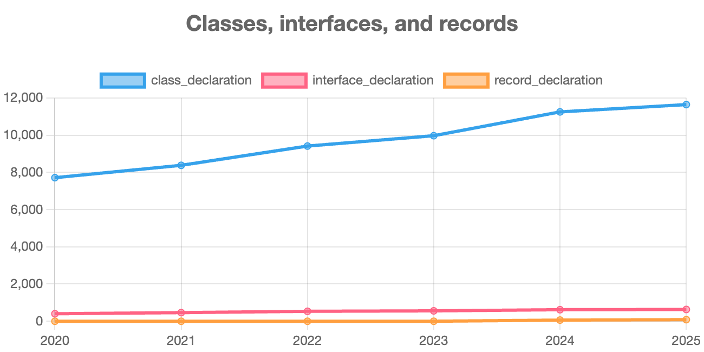

# Análise de Evolução de Código - Spring Boot

Este repositório contém a análise da evolução do código do projeto Spring Boot, realizada como parte do exercício da disciplina. A análise foi feita com base em um relatório gerado pela ferramenta GitEvo.

---

**Repositório selecionado:** `https://github.com/spring-projects/spring-boot`

**Gráfico selecionado:** Evolução de Declarações de Tipos: Classes vs. Records

A análise foca na evolução comparativa entre o número de declarações de `class` e a introdução e crescimento das declarações de `record`.

Os dados abaixo foram extraídos do relatório de evolução.

**Explicação:**

A análise da evolução das declarações de classes e a introdução de records no projeto Spring Boot revela uma adaptação clara e estratégica às novas funcionalidades da linguagem Java.

1.  **Crescimento Contínuo das Classes (2020-2025):**
    [cite_start]Observa-se um crescimento robusto e constante no número de declarações de classes, passando de 7.714 em 2020 para 11.641 em 2025. Este crescimento é esperado em um projeto ativo e em expansão como o Spring Boot, refletindo a adição de novas funcionalidades, módulos e melhorias ao longo dos anos. A classe continua sendo a estrutura fundamental para a maior parte da lógica de negócio, serviços, controladores e componentes do framework.

2.  **O Ponto de Inflexão: A Adoção de Records (2024):**
    [cite_start]O dado mais interessante é a ausência de `record_declaration` até 2023, seguida por sua súbita aparição em 2024 com 62 declarações, crescendo para 85 no ano seguinte. Isso marca um ponto de inflexão claro e deliberado na estratégia de desenvolvimento do projeto. Os `Records` foram introduzidos como uma funcionalidade padrão no Java 16 (lançado em 2021) e servem como uma forma concisa de criar classes que são "transportadoras de dados" imutáveis (immutable data carriers).

3.  **Implicações e Boas Práticas:**
    * **Modernização do Código:** A adoção de `Records` demonstra o compromisso da equipe do Spring Boot em modernizar a base de código. Em vez de escrever classes verbosas com construtores, `getters`, `equals()`, `hashCode()` e `toString()` (o chamado "boilerplate code"), os desenvolvedores agora podem usar `Records` para simplificar drasticamente a definição de DTOs (Data Transfer Objects), objetos de configuração e outras estruturas de dados simples.
    * **Melhora na Qualidade e Legibilidade:** O uso de `Records` está alinhado com boas práticas de programação. Ele promove a imutabilidade, o que torna o código mais seguro em ambientes concorrentes e mais fácil de raciocinar. A sintaxe declarativa e concisa melhora a legibilidade e reduz a chance de erros que poderiam ocorrer na implementação manual dos métodos padrão.
    * [cite_start]**Adoção Gradual e Estratégica:** O crescimento de 62 para 85 `Records` em apenas um ano sugere que a nova funcionalidade foi bem recebida e está sendo ativamente utilizada em novos desenvolvimentos ou na refatoração de código existente[cite: 1]. A equipe não substituiu todas as classes possíveis por `Records` de uma vez, mas sim iniciou um processo de adoção onde faz mais sentido, o que é uma abordagem prudente em um projeto de grande escala.

Em resumo, a evolução destas métricas ilustra como um projeto maduro como o Spring Boot não apenas cresce em tamanho, mas também evolui em qualidade, adotando novas funcionalidades da linguagem para escrever um código mais limpo, seguro e moderno.